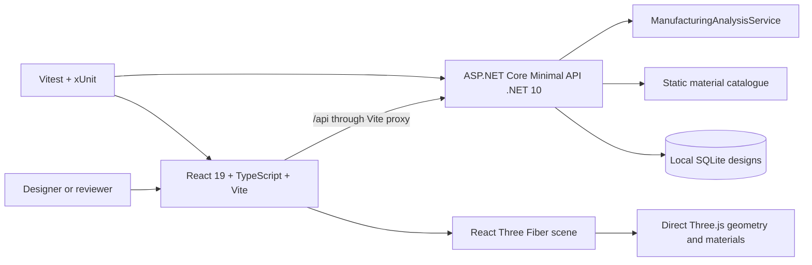

# Lattice Forge

Lattice Forge is an interview-scale DfAM workspace: designers adjust a parametric mechanical bracket, reveal a bounded conceptual lattice, and inspect deterministic, illustrative manufacturing estimates from a .NET API.

> Screenshot placeholder: no verified screenshot is committed. Run the local app below to capture one from the actual browser/device under review.

## Architecture



The browser owns interaction and presentation. The API owns validation and manufacturing equations. The Vite development proxy keeps local setup simple without broad CORS configuration.

## Run locally

Requirements: .NET 10 SDK, Node.js, and pnpm 10.33.1.

### Fast path

From the repository root:

```powershell
./start-dev.ps1
```

The script starts both servers without opening helper windows, writes their output to the user temporary directory, and stops both process trees when interrupted. The manual commands below remain the fallback.

### Manual fallback

Use two PowerShell terminals:

```powershell
./scripts/start-backend.ps1
./scripts/start-frontend.ps1
```

The API runs at `http://localhost:5100`. The Vite client runs at `http://localhost:5173` and proxies `/api` to the API.

Install frontend dependencies and run focused commands from `src/LatticeForge.Web`:

```powershell
pnpm install --frozen-lockfile
pnpm test
pnpm build
pnpm lint
```

## API

All JSON uses camel-case properties and manufacturing process enum values are strings.

| Method | Endpoint | Purpose |
|---|---|---|
| GET | `/api/health` | Reports API availability. |
| GET | `/api/materials` | Lists deterministic illustrative material profiles. |
| POST | `/api/analyses` | Validates a design and returns deterministic manufacturing estimates. |
| POST | `/api/designs` | Persists a validated design snapshot in local SQLite. |
| GET | `/api/designs` | Lists saved designs, newest first. |
| GET | `/api/designs/{id}` | Restores one saved design. |

Invalid analysis and persistence requests return HTTP 400 Problem Details. The API validates dimensions, wall thickness, hole radius, lattice density, material, and process compatibility.

## Domain model and units

The UI sends length, height, depth, wall thickness, and hole radius in millimetres. Lattice density is normalized to `[0, 1]`. Material density is `g/cm^3`, cost is `EUR/kg`, and deposition rate is the illustrative `cm^3/min` input used for time estimation.

The API's deterministic, simplified equations are:

```text
wallFactor = 0.22 + clamp(wallThickness / 20, 0, 1) * 0.08
envelopeMm3 = length * height * depth * wallFactor
holesMm3 = pi * holeRadius^2 * depth * 2 * 0.9
solidVolumeCm3 = max(0.001, (envelopeMm3 - holesMm3) / 1000)
optimizedVolumeCm3 = solidVolumeCm3 * (0.30 + latticeDensity * 0.45)
estimatedWeightG = optimizedVolumeCm3 * densityGPerCm3
estimatedCostEur = estimatedWeightG / 1000 * costPerKg
estimatedPrintMinutes = max(1, optimizedVolumeCm3 / depositionRateCm3PerMinute)
materialReductionPercent = clamp((1 - optimizedVolumeCm3 / solidVolumeCm3) * 100, 0, 100)
```

The printability score combines bounded wall, density, and geometry heuristics. It is a repeatable interaction model, not process simulation or engineering validation.

## Why React Three Fiber and direct Three.js

React Three Fiber provides a declarative React boundary for the canvas, scene composition, camera controls, and lifecycle integration. Direct Three.js APIs remain inside focused geometry modules where explicit `Shape`, `ExtrudeGeometry`, `InstancedMesh`, `Plane`, material, and disposal control matters. This keeps React state separate from render-loop state while avoiding an unnecessary abstraction over geometry generation.

## Performance decisions

- The conceptual lattice uses one bounded `InstancedMesh`, capped at 512 struts on desktop and 256 on narrow screens.
- Geometry and materials use `useMemo` and explicit disposal; compare mode uses clipping planes rather than rebuilding meshes while dragging.
- Device pixel ratio is capped at 1.5 on desktop and 1 on narrow screens.
- Expensive shadows are disabled for narrow screens; post-processing is intentionally absent.
- Analysis requests are debounced and stale requests are cancelled with `AbortController`.
- The optimization scan reuses render-loop vectors, planes, colours, and uniforms instead of allocating per frame.

## Accessibility and honest boundaries

Native range, number, select, button, and dialog controls provide keyboard access. Focus-visible styling, accessible names, status announcements, validation associations, reduced-motion handling, a heatmap legend, and non-colour risk text are included. Raw 3D orbit manipulation remains pointer-oriented by design; the surrounding workflow is keyboard reachable.

Saved designs use local SQLite with a simple startup `EnsureCreated` strategy suitable for a disposable demo, not a production migration process. STL and JSON exports are conceptual demo outputs. The lattice has not been checked for watertightness or printability, and every manufacturing result is an illustrative estimate rather than engineering validation.

## Verification

From `C:\Source\materialise`:

```powershell
dotnet build LatticeForge.sln
dotnet test LatticeForge.sln
```

From `C:\Source\materialise\src\LatticeForge.Web`:

```powershell
pnpm test
pnpm build
pnpm lint
pnpm audit --prod --audit-level high
```

The current suite covers domain/API contracts, persistence, geometry normalization, lattice bounds, analysis cancellation, optimization state, responsive controls, and exports.

## What I would build next

1. Replace heuristic estimates with validated process/material models and versioned calculation contracts.
2. Replace `EnsureCreated` with reviewed EF Core migrations and an operational persistence boundary.
3. Add browser/device accessibility and visual regression coverage, including real WebGL context recovery.
4. Split the production bundle and add observability around analysis latency and WebGL failures.
5. Validate watertight lattice generation and printability before exposing exports as manufacturing artefacts.

See [`docs/README.md`](docs/README.md) for the living architecture, business boundaries, and phase evidence.
