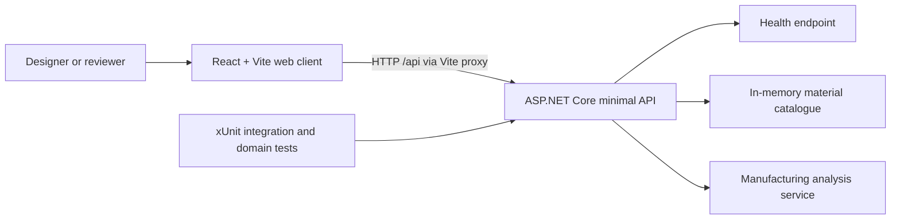

# Technical architecture

Lattice Forge currently provides a runnable React client and ASP.NET Core API for deterministic, illustrative additive-manufacturing analysis. The architecture is deliberately small: the browser owns presentation, the API owns manufacturing calculations, and automated tests protect the public behaviour.

## System context



The development client runs on `http://localhost:5173` and proxies `/api` requests to the API at `http://localhost:5100`. The proxy avoids enabling broad CORS for local development.

## Implemented components

| Component | Responsibility | Current technology |
|---|---|---|
| Web client | Render the responsive manufacturing workspace, Three.js bracket viewport, and report API availability | React 19, TypeScript, Vite 8, React Three Fiber, Three.js, Drei, CSS, Lucide React, Zustand |
| Minimal API | Expose health, material, and analysis contracts | ASP.NET Core on .NET 10 |
| Material catalogue | Supply one deterministic example material per manufacturing process | In-memory static catalogue |
| Analysis service | Validate requests and calculate illustrative metrics | Stateless C# domain service |
| API tests | Verify domain rules and HTTP contracts | xUnit and `WebApplicationFactory` |

## Solution layout

```text
LatticeForge.sln
src/
  LatticeForge.Api/
    Manufacturing/          # Domain records, catalogue, and analysis service
    Program.cs              # Dependency registration and minimal API endpoints
  LatticeForge.Web/
    src/                    # React foundation UI and styles
tests/
  LatticeForge.Api.Tests/   # Domain and endpoint tests
docs/                       # Living technical and business documentation
```

`ManufacturingAnalysisService` contains the calculations. Endpoints translate successful results or domain validation failures into HTTP responses; they do not contain manufacturing equations.

## HTTP API

All successful JSON responses use camel-case property names. `ManufacturingProcess` values are serialized as strings.

### `GET /api/health`

Returns API availability.

```json
{
  "status": "ok",
  "service": "Lattice Forge API"
}
```

### `GET /api/materials`

Returns a deterministic array of material profiles. A material contains:

| Field | Meaning | Unit |
|---|---|---|
| `id`, `name` | Stable identifier and display name | — |
| `process` | `Sls`, `Sla`, or `MetalLpbf` | — |
| `density` | Material density used for weight | g/cm³ |
| `costPerKg` | Illustrative material price | EUR/kg |
| `minimumWallThickness` | Warning threshold | mm |
| `depositionRate` | Simplified production rate | cm³/min |

The catalogue currently contains `aluminum-sls`, `resin-sla`, and `titanium-lpbf`. These are demo profiles, not procurement or machine specifications.

### `POST /api/analyses`

Accepts the selected material and process plus bracket geometry:

```json
{
  "parameters": {
    "length": 120,
    "height": 80,
    "depth": 40,
    "wallThickness": 4,
    "holeRadius": 8,
    "latticeDensity": 0.5
  },
  "materialId": "aluminum-sls",
  "process": "Sls"
}
```

Dimensions are millimetres. `latticeDensity` is a normalized value from `0` to `1`.

A successful response contains:

| Field | Unit or type |
|---|---|
| `solidVolume`, `optimizedVolume` | cm³ |
| `estimatedWeight` | g |
| `estimatedCost` | EUR |
| `estimatedPrintMinutes` | min |
| `materialReductionPercent` | % |
| `printabilityScore` | integer, 0–100 |
| `supportRisk` | `Low`, `Medium`, or `High` |
| `warnings` | array of explanatory strings |
| `illustrativeEstimate` | always `true` in the current implementation |

Invalid requests return RFC 9457-style `application/problem+json` with HTTP 400, a stable title, and a specific validation detail.

## Manufacturing model

The model is deterministic and intentionally simplified. It supports product interaction and architectural demonstration; it does not simulate a machine or certify a design.

Let:

- `L`, `H`, and `D` be length, height, and depth in millimetres;
- `T` be wall thickness in millimetres;
- `R` be hole radius in millimetres; and
- `Q` be normalized lattice density in `[0, 1]`.

The current equations are:

```text
wallFactor = 0.22 + clamp(T / 20, 0, 1) × 0.08
envelopeMm³ = L × H × D × wallFactor
holesMm³ = π × R² × D × 2 × 0.9
solidVolumeCm³ = max(0.001, (envelopeMm³ - holesMm³) / 1000)

optimizedVolumeCm³ = solidVolumeCm³ × (0.30 + Q × 0.45)
estimatedWeightG = optimizedVolumeCm³ × densityGPerCm³
estimatedCostEur = estimatedWeightG / 1000 × costPerKg
estimatedPrintMinutes = max(1, optimizedVolumeCm³ / depositionRateCm³PerMin)
materialReductionPercent = clamp((1 - optimizedVolumeCm³ / solidVolumeCm³) × 100, 0, 100)
```

The printability score combines wall-thickness adequacy, distance from a mid-density target, and a normalized hole-size factor. The score is clamped to `0–100`; risk is Low at 80 or above, Medium from 55 to 79, and High below 55. Values are rounded only when the result record is created.

### Model properties protected by tests

- identical input produces identical output;
- increasing lattice density increases optimized volume;
- increasing wall thickness increases weight for the tested valid range;
- printability remains between 0 and 100; and
- optimized volume remains lower than solid volume for valid density values.

## Validation

The service rejects:

- length, height, or depth outside `(0, 1000]` mm;
- wall thickness that is non-positive or does not fit within half the smallest bracket dimension;
- hole radius that is non-positive or does not fit within half the smaller face dimension;
- lattice density outside `[0, 1]`;
- unknown material identifiers; and
- material/process combinations that do not match.

Wall thickness below the material profile's minimum is accepted with a warning rather than rejected. This supports exploration while making the risk visible.

## Testing and TDD

Changes follow Red–Green–Refactor. Tests are written and observed failing for the intended reason before the smallest production change is made. The relevant suite is rerun after refactoring.

Current coverage includes:

- one health endpoint integration test;
- deterministic analysis and domain validation tests;
- monotonicity and score-bound tests; and
- material and analysis endpoint integration tests, including Problem Details.

Run the backend verification from the repository root:

```powershell
dotnet build LatticeForge.sln
dotnet test LatticeForge.sln --no-build
```

Run the current frontend build from `src/LatticeForge.Web`:

```powershell
pnpm install --frozen-lockfile
pnpm build
```

Frontend component tests are implemented in phase 02. They run in jsdom through Vitest and Testing Library, and currently protect major workspace regions, accessible names, and explicit empty analysis states.

## Frontend workspace shell (phases 02-03)

The client presents a responsive industrial workspace with explicit page regions: header and API status, design controls, a Three.js viewport, manufacturing analysis, and viewport toolbar. The UI state boundary is `useWorkspaceStore.ts`; it still owns only view mode and grid visibility. Geometry parameters remain phase-03 defaults until the controls are connected in phase 04.

The shell uses semantic headings, labelled controls, live API status, visible focus rings, and responsive layouts down to 560px. Lucide icons are inline SVG components. The central viewport now uses React Three Fiber and procedural Three.js resources, with a CSS fallback when WebGL is unavailable.

Frontend component tests in `App.test.tsx` verify accessible region names and explicit empty analysis metrics. `geometryParameters.test.ts` protects pure normalization before values reach Three.js. They run in jsdom through Vitest and Testing Library. `pnpm test`, `pnpm build`, and `pnpm lint` are the current frontend checks.

## Three.js viewport (phase 03)

`ThreeViewport.tsx` owns the Canvas boundary, WebGL capability fallback, DPR cap, camera labels, and reset action. `BracketScene.tsx` owns camera, constrained damped `OrbitControls`, procedural studio lights, contact shadows, and the optional floor grid. `BracketGeometry.tsx` owns the generated mechanical silhouette and its GPU resources.

The scene scale is **1 world unit = 1 millimetre**. `normalizeBracketParameters` clamps non-finite or unsafe values before they reach `Shape` and `ExtrudeGeometry`. The bracket is an extruded XY silhouette with two `Shape.holes` mounting holes and bevelled edges. Titanium-like `MeshPhysicalMaterial` and restrained cyan `Edges` provide the visual treatment; pointer hover and click update material feedback without rebuilding geometry.

Geometry and material instances are memoized by geometry parameters and disposed on replacement or unmount. No render-loop allocations are introduced. The Canvas caps device pixel ratio at 1.75 and uses only local procedural lighting; no HDR or remote runtime asset is required. A narrow or unavailable WebGL context leaves the surrounding design and analysis panels usable.


## Parametric design controls (phase 04)

`useDesignStore.ts` is the single browser-side source of truth for normalized length, height, depth, wall thickness, hole radius, lattice density, process, material, and view selections. `normalizeBracketParameters` clamps geometry before it reaches Three.js; lattice density is clamped to 0–100%. Three named presets (Lightweight, Balanced, Reinforced) and Reset Design update the same state and expose a modified indicator relative to the active preset.

`DesignControls.tsx` renders paired range and numeric inputs with explicit units, bounded steps, keyboard-operable native controls, and accessible labels/current values. Materials are loaded from `GET /api/materials`; the material select is filtered to the selected process and changing process chooses its compatible catalogue entry. If the API is unavailable, a small deterministic demo catalogue keeps the shell usable without pretending that analysis succeeded.

`ThreeViewport` passes the current normalized dimensions through `BracketScene` to `BracketGeometry`, so all five geometric dimensions update the visible bracket while dragging. The viewport dimensions label is derived from the same state. Persistence and export are implemented in phase 08.

## Lattice reveal and comparison (phase 05)

`latticeStructure.ts` contains the pure deterministic lattice generator. It maps normalized 0–100 density to repeated diagonal pairs across bounded X/Y/Z cells. An explicit hard cap of `LATTICE_MAX_INSTANCES = 512` bounds GPU work; endpoints are inset by wall thickness from the bracket envelope. This is a conceptual lightweighting visualization, not a validated octet-truss or printable lattice.

`LatticeStructureView.tsx` renders all struts through one Three.js `InstancedMesh`, reusing cylinder geometry and a cyan/titanium material. Matrices update only when parameters change; geometry and material are disposed on replacement or unmount. `useDesignStore.designViewMode` drives `solid`, `optimized`, and `compare`. Compare mode uses opposing local clipping planes and a luminous boundary; the viewport handle supports pointer dragging and arrow/Home/End keyboard input.
## Current constraints

- The catalogue is compiled into the API; saved designs use a local SQLite database without authentication or multi-user administration.
- The analysis service uses heuristic equations, not finite-element, thermal, slicing, support-generation, or machine-specific simulation.
- Validation exceptions are translated at the HTTP boundary; there is no richer domain error model yet.
- Authentication, authorization, observability, rate limiting, and production deployment are outside the demo's current scope.
- The web client calls health, materials, and analysis endpoints; analysis results remain illustrative.
- Design controls drive the local Three.js geometry and debounced API analysis; phase 08 adds local design persistence and demo exports.

## Planned, not implemented

The following capabilities appear in the build plan but **do not exist in the current application**:

- engineering-grade manufacturing validation;
- production deployment and observability;
- broader frontend interaction and end-to-end coverage; and
- production deployment or engineering-grade manufacturing validation.

## Manufacturing-analysis integration (phase 06)

`manufacturingApi.ts` owns the typed browser contract for `POST /api/analyses`; it serializes the normalized lattice density expected by the API and raises typed errors for HTTP failures. `useManufacturingAnalysis.ts` owns presentation-side orchestration: a 320 ms debounce, an `AbortController` per request, sequence checks, and explicit `idle`, `loading`, `success`, `validation`, `unavailable`, and `error` states. Cleanup aborts timers and in-flight work so rapid slider changes cannot let stale results overwrite the newest design.

`ManufacturingAnalysisPanel.tsx` formats API-authoritative values only. It renders score, optimized weight, illustrative cost/time, material reduction, support risk, warnings, suggested corrections, and a compact Solid-versus-Optimized volume/weight comparison. The disclosure “Illustrative estimate — not engineering validation” remains visible in every state. Numeric values use a CSS transition and disable motion under `prefers-reduced-motion`; no animation library or duplicate manufacturing equation is present in the client.

Frontend tests cover debounce and cancellation, success, validation failure, unavailable/retry, and panel rendering. The 3D viewport remains independent: API failures update only the analysis panel and never unmount or replace the Three.js scene.

Phase 06 supersedes the earlier planned note that analysis was not connected: design controls now drive both local geometry and debounced API analysis, while the API remains authoritative for all manufacturing equations. Optimization animation is implemented in phase 07; persistence and export are implemented in phase 08; engineering-grade validation remains out of scope.

## Optimization scan and risk heatmap (phase 07)

`optimizationSequence.ts` defines the presentation-only state machine for the controlled Optimize for Manufacturing sequence. `useOptimizationSequence.ts` owns cancellation, skip, reduced-motion completion, and the single-run guard; it never mutates domain design state.

`heatmapRisk.ts` derives a deterministic risk value from surface orientation, process threshold, wall thickness, and view geometry. `RiskHeatmap.tsx` renders the reusable color ramp and an explicit text/pattern warning representation. `BracketScene.tsx` reuses the scan plane and clipping resources while the sequence reveals the lattice and transitions into Compare mode.

The scan is resize-safe because its plane is derived from the current bracket bounds. API failures do not fabricate optimized metrics: the visual sequence may complete, while the analysis panel retains its error state. Engineering-grade validation remains planned.

## Frontend package management

The frontend is the repository's only JavaScript package and uses pnpm 10.33.1. Its lockfile lives at `src/LatticeForge.Web/pnpm-lock.yaml`; there is no root `package.json` and no `pnpm-workspace.yaml`. This keeps dependency resolution local to the web client without introducing workspace management overhead.

## Design persistence and export (phase 08)

The API stores DesignEntity records in SQLite and exposes POST /api/designs, GET /api/designs, and GET /api/designs/{id}. DesignService owns request validation, mapping, schema-version checks, and validation of restored rows through the same ManufacturingAnalysisService rules used by analysis. The local startup path uses Database.EnsureCreated() for deterministic demo bootstrap; production would require reviewed migrations and operational database management.

The web client keeps persistence orchestration in DesignPersistenceControls.tsx and typed request/export helpers in designPersistence.ts. Save uses an accessible name dialog; Recent Designs loads and restores parameters without changing camera/view state. STL export builds a temporary optimized bracket+lattice scene, uses STLExporter, then disposes cloned geometry/material resources. JSON export includes schema version, selected process/material, parameters, and the illustrative-data disclaimer. Export filenames are reduced to safe ASCII filename characters and failures are shown as live status/error messages.

The lattice STL is a conceptual demo mesh. The application does not claim watertightness, printability, engineering validation, or Materialise affiliation.

## Responsiveness, accessibility, and performance hardening (phase 09)

Phase 09 hardens the existing workspace without adding a product capability. Design Controls and Manufacturing Analysis can collapse independently on narrow layouts while the viewport remains present. Native controls retain accessible names, pressed/expanded state, visible focus, status announcements, dialog focus trapping, and error associations. The compare split remains keyboard-operable through arrows, Home, and End.

ThreeViewport now derives a bounded rendering budget: desktop DPR is capped at 1.5, narrow layouts use DPR 1, lattice instances are capped at 512 on desktop and 256 on narrow layouts, and expensive shadows/contact shadows are disabled on narrow screens. Geometry, materials, clipping planes, and lattice instance matrices remain memoized or updated only when their inputs change. WebGL context loss/restoration events are surfaced without taking down the surrounding controls.

The browser media query for prefers-reduced-motion is forwarded to OrbitControls and disables damping; CSS also removes decorative animation and transitions. Health, materials, WebGL, analysis, validation, loading, and offline states remain explicit. A real browser/device matrix is not automated in Vitest; manual checks remain required for WebGL context loss, screen-reader output, and the 1440x900, 1280x720, 1024x768, and 390px visual breakpoints.