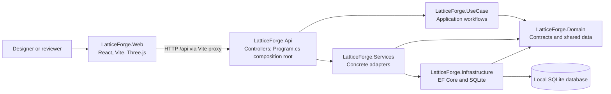
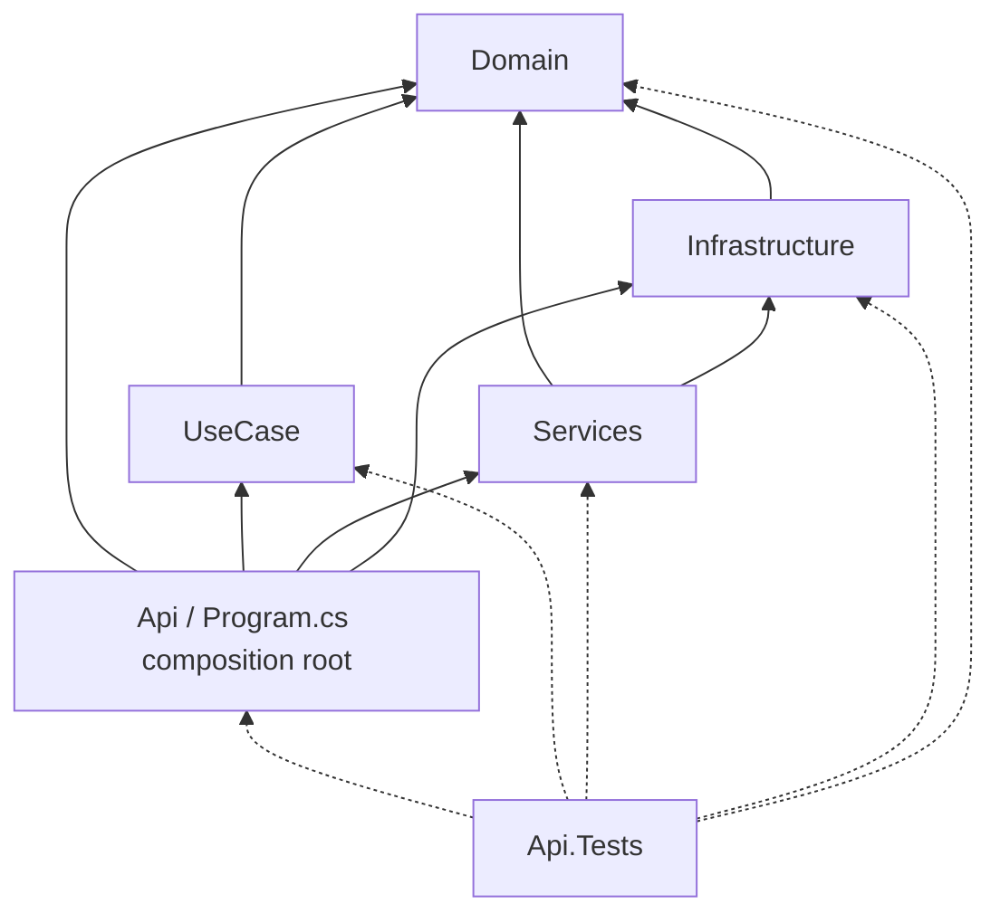
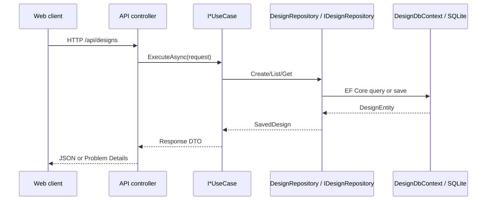

# Technical architecture

Lattice Forge is a React/Vite client backed by a controller-based ASP.NET Core API. The backend is split into Domain, UseCase, Services, Infrastructure, and API projects: dependencies point inward to Domain, while `src/LatticeForge.Api/Program.cs` composes the concrete runtime.

## System at a glance



The development client runs on `http://localhost:5173` and proxies `/api` to the API at `http://localhost:5100`. The web client is an independent JavaScript package; it is not a member of `LatticeForge.sln` and has no compile-time dependency on the .NET projects.

## Project boundaries

| Project | Owns | Direct project dependencies |
|---|---|---|
| `LatticeForge.Domain` | Domain DTOs, `DesignEntity`, repository contract, and time-provider abstraction | None |
| `LatticeForge.UseCase` | Application workflows, request/response DTOs, validation, catalogue, and deterministic manufacturing calculations | Domain |
| `LatticeForge.Infrastructure` | `DesignDbContext`, EF Core model configuration, SQLite registration, and demo database initialization | Domain |
| `LatticeForge.Services` | EF Core-backed `DesignRepository`, entity-to-domain mapping, and the system UTC clock | Domain, Infrastructure |
| `LatticeForge.Api` | Controllers, JSON/Problem Details configuration, dependency injection, and startup composition | Domain, UseCase, Services, Infrastructure |
| `LatticeForge.Web` | Browser state, HTTP clients, accessible workspace UI, Three.js scene, persistence controls, and exports | HTTP contracts only |
| `LatticeForge.Api.Tests` | Backend unit, controller, host, and SQLite integration tests | All five .NET production projects |

The source dependency graph is acyclic. `src/LatticeForge.Api/Program.cs` is the composition root: inner projects do not register themselves against API concerns, and `LatticeForge.UseCase` depends only on `LatticeForge.Domain`.



## Backend organization

### Domain contracts

`LatticeForge.Domain` contains data and abstractions shared across the backend:

```text
Dtos/
  Designs/SavedDesign.cs
  Manufacturing/
    BracketParameters.cs
    ManufacturingAnalysis.cs
    ManufacturingProcess.cs
    MaterialProfile.cs
Entities/DesignEntity.cs
Repositories/IDesignRepository.cs
Services/IDateTimeProvider.cs
```

The namespaces follow the folders: design snapshots use `LatticeForge.Domain.Dtos.Designs`, while manufacturing records and enums use `LatticeForge.Domain.Dtos.Manufacturing`. `IDesignRepository` exposes create, list, and get operations without referencing EF Core. `IDateTimeProvider.GetDateTimeNow()` makes creation timestamps controllable in tests.

### Use cases

Each application workflow has a feature folder and namespace that names the action without a redundant `UseCase` folder suffix. The implementation class keeps the `UseCase` role in its name, has no `Impl` suffix, and implements an `I*UseCase` interface in the same feature file.

| Feature folder and namespace | Interface | Implementation |
|---|---|---|
| `Designs/CreateDesign` | `ICreateDesignUseCase` | `CreateDesignUseCase` |
| `Designs/GetDesign` | `IGetDesignUseCase` | `GetDesignUseCase` |
| `Designs/GetDesigns` | `IGetDesignsUseCase` | `GetDesignsUseCase` |
| `Health/GetHealth` | `IGetHealthUseCase` | `GetHealthUseCase` |
| `Manufacturing/AnalyzeMaterials` | `IAnalyzeMaterialsUseCase` | `AnalyzeMaterialsUseCase` |
| `Manufacturing/GetMaterials` | `IGetMaterialsUseCase` | `GetMaterialsUseCase` |

Feature-specific HTTP-facing request and response records live under each feature's `Dtos` namespace. Shared validation, catalogue, and calculation helpers live under `Designs/Helpers` or `Manufacturing/Helpers` rather than in controllers.

`CreateDesignUseCase` validates the command, asks `IDateTimeProvider` for the current time once, and uses that value for both `CreatedAt` and `UpdatedAt`. The other design workflows validate restored snapshots before returning them; the list workflow orders designs by update time and then creation time, newest first.

### Services and persistence

`LatticeForge.Services` contains concrete adapters:

- `Repositories/DesignRepository.cs` implements `IDesignRepository` over `DesignDbContext`.
- `Mappers/DesignMapper.cs` publicly maps `DesignEntity` to `SavedDesign`; the inverse mapping remains private to the repository.
- `DateTimeProvider.cs` implements `IDateTimeProvider` and is the only production location that reads `DateTimeOffset.UtcNow`.

`LatticeForge.Infrastructure` owns `DesignDbContext`, its EF Core model configuration, SQLite provider registration, and database bootstrap. `Persistence/DesignDbContext.cs` exposes the designs set and configures keys, required strings, enum conversion, lengths, and the update-time index. `InfrastructureServiceCollectionExtensions` registers the SQLite context and calls `Database.EnsureCreated()` during API startup. `LatticeForge.Services` owns the EF Core-backed `DesignRepository` adapter that consumes this context and executes persistence queries.

`EnsureCreated()` is intentional for a disposable local demo. It is not a migration or production schema-evolution strategy; reviewed EF Core migrations, deployment controls, backups, concurrency, authentication, and authorization remain outside the current scope.

### Composition root and request flow

`src/LatticeForge.Api/Program.cs` registers:

- all six use-case interfaces as scoped services;
- `IDesignRepository -> DesignRepository` as scoped;
- `IDateTimeProvider -> DateTimeProvider` as singleton;
- `DesignDbContext` through `AddLatticeForgeInfrastructure`; and
- controllers, string-enum JSON serialization, and Problem Details.

Controllers depend on use-case interfaces, not concrete implementations. A persisted-design request follows this path:



Health, catalogue, and analysis workflows stop in the UseCase layer because they do not require persistence. Controllers translate successful results and `ArgumentException` validation failures into HTTP responses; they do not contain manufacturing equations.

## HTTP API

Successful JSON uses camel-case properties, and `ManufacturingProcess` values are serialized as strings.

| Method | Route | Use case | Success | Relevant failure |
|---|---|---|---|---|
| `GET` | `/api/health` | `IGetHealthUseCase` | `200` health record | - |
| `GET` | `/api/materials` | `IGetMaterialsUseCase` | `200` material array | - |
| `POST` | `/api/analyses` | `IAnalyzeMaterialsUseCase` | `200` analysis | `400` Problem Details |
| `POST` | `/api/designs` | `ICreateDesignUseCase` | `201` saved design | `400` Problem Details |
| `GET` | `/api/designs` | `IGetDesignsUseCase` | `200` design array | `400` for invalid stored data |
| `GET` | `/api/designs/{id}` | `IGetDesignUseCase` | `200` saved design | `404`, or `400` for invalid stored data |

The frontend centralizes these paths in `src/LatticeForge.Web/src/apiClient.ts`. Vite forwards the same `/api` paths during local development, so the browser contract is unchanged by the backend project split.

## Manufacturing contract

Analysis accepts bracket geometry, a material identifier, and a process. Dimensions are millimetres and lattice density is normalized to `[0, 1]` on the API contract. Material density is `g/cm^3`, cost is `EUR/kg`, and deposition rate is the illustrative `cm^3/min` input.

```text
wallFactor = 0.22 + clamp(wallThickness / 20, 0, 1) * 0.08
envelopeMm3 = length * height * depth * wallFactor
holesMm3 = pi * holeRadius^2 * depth * 2 * 0.9
solidVolumeCm3 = max(0.001, (envelopeMm3 - holesMm3) / 1000)
optimizedVolumeCm3 = solidVolumeCm3 * (0.30 + latticeDensity * 0.45)
estimatedWeightG = optimizedVolumeCm3 * densityGPerCm3
estimatedCostEur = estimatedWeightG / 1000 * costPerKg
estimatedPrintMinutes = max(1, optimizedVolumeCm3 / depositionRateCm3PerMinute)
materialReductionPercent = clamp((1 - optimizedVolumeCm3 / solidVolumeCm3) * 100, 0, 100)
```

`ManufacturingAnalysisHelper` owns these deterministic equations. `ManufacturingValidationHelper` rejects non-finite or out-of-range dimensions, invalid wall thickness or hole radius, lattice density outside `[0, 1]`, unknown material IDs, and incompatible material/process combinations. A wall below the selected material's minimum produces a warning rather than rejection. Results remain illustrative and do not certify a design.

## Frontend architecture

`LatticeForge.Web` is the only JavaScript package and uses pnpm 10.33.1 with a package-local `pnpm-lock.yaml`. React and Zustand own application state; React Three Fiber owns the declarative canvas boundary; focused geometry modules use direct Three.js APIs for shapes, instancing, clipping, materials, and disposal.

The typed browser clients separate transport from presentation:

- `manufacturingApi.ts` calls `/api/analyses`; `useManufacturingAnalysis.ts` debounces requests, aborts stale work, and exposes explicit states.
- `designPersistence.ts` calls the design endpoints and owns typed persistence/export helpers.
- `DesignPersistenceControls.tsx` owns the accessible save/recent-design interaction without changing the camera or view state.

The conceptual lattice uses one bounded `InstancedMesh`; rendering budgets cap device pixel ratio and instance count. The optimization scan and risk heatmap are presentation-only and never replace API-authoritative manufacturing metrics. STL and JSON exports remain conceptual demo outputs, not validated manufacturing artefacts.

## Testing strategy

Backend tests live in `tests/LatticeForge.Api.Tests` and use xUnit:

- use-case tests protect validation, deterministic calculations, ordering, and response mapping;
- controller tests protect routes, status codes, JSON-facing contracts, and Problem Details;
- `WebApplicationFactory` tests run the composed host with isolated SQLite storage;
- repository tests exercise EF Core/SQLite round trips and entity mapping; and
- clock tests verify UTC behavior while create-design tests inject a fixed `IDateTimeProvider`.

Frontend tests are colocated with source and run in jsdom through Vitest and Testing Library. They cover stores, HTTP contracts and cancellation, persistence, controls, exports, geometry normalization, lattice bounds, rendering budgets, optimization, and accessible states.

Run the maintained checks with:

```powershell
# Repository root
dotnet build LatticeForge.sln
dotnet test LatticeForge.sln --no-build

# src/LatticeForge.Web
pnpm install --frozen-lockfile
pnpm test
pnpm build
pnpm lint
```

The automated frontend suite does not provide a real browser, GPU, or device matrix. WebGL context recovery, screen-reader output, responsive visual breakpoints, and the raw pointer-oriented orbit interaction still require manual browser/device verification. There is no end-to-end browser suite or production database migration test.

## Current constraints

- Manufacturing calculations are deterministic heuristics, not finite-element, thermal, slicing, support-generation, or machine-specific simulation.
- The material catalogue is compiled into the UseCase project.
- SQLite is local and uses `EnsureCreated`; the demo has no multi-user or operational data-management boundary.
- Validation exceptions are translated at the controller boundary; there is no richer domain error model.
- Authentication, authorization, observability, rate limiting, production deployment, and engineering-grade export validation are not implemented.
- The lattice has not been verified for watertightness, structural performance, or printability.
