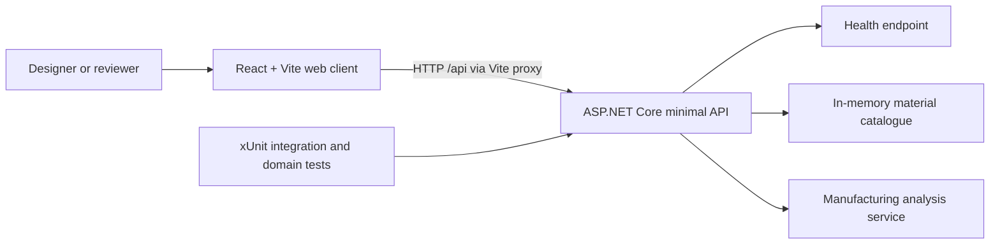

# Technical architecture

Lattice Forge currently provides a runnable React client and ASP.NET Core API for deterministic, illustrative additive-manufacturing analysis. The architecture is deliberately small: the browser owns presentation, the API owns manufacturing calculations, and automated tests protect the public behaviour.

## System context



The development client runs on `http://localhost:5173` and proxies `/api` requests to the API at `http://localhost:5100`. The proxy avoids enabling broad CORS for local development.

## Implemented components

| Component | Responsibility | Current technology |
|---|---|---|
| Web client | Render the responsive manufacturing workspace shell and report API availability | React 19, TypeScript, Vite 8, CSS, Lucide React, Zustand |
| Minimal API | Expose health, material, and analysis contracts | ASP.NET Core on .NET 10 |
| Material catalogue | Supply one deterministic example material per manufacturing process | In-memory static catalogue |
| Analysis service | Validate requests and calculate illustrative metrics | Stateless C# domain service |
| API tests | Verify domain rules and HTTP contracts | xUnit and `WebApplicationFactory` |

## Solution layout

```text
LatticeForge.sln
src/
  LatticeForge.Api/
    Manufacturing/          # Domain records, catalogue, and analysis service
    Program.cs              # Dependency registration and minimal API endpoints
  LatticeForge.Web/
    src/                    # React foundation UI and styles
tests/
  LatticeForge.Api.Tests/   # Domain and endpoint tests
docs/                       # Living technical and business documentation
```

`ManufacturingAnalysisService` contains the calculations. Endpoints translate successful results or domain validation failures into HTTP responses; they do not contain manufacturing equations.

## HTTP API

All successful JSON responses use camel-case property names. `ManufacturingProcess` values are serialized as strings.

### `GET /api/health`

Returns API availability.

```json
{
  "status": "ok",
  "service": "Lattice Forge API"
}
```

### `GET /api/materials`

Returns a deterministic array of material profiles. A material contains:

| Field | Meaning | Unit |
|---|---|---|
| `id`, `name` | Stable identifier and display name | — |
| `process` | `Sls`, `Sla`, or `MetalLpbf` | — |
| `density` | Material density used for weight | g/cm³ |
| `costPerKg` | Illustrative material price | EUR/kg |
| `minimumWallThickness` | Warning threshold | mm |
| `depositionRate` | Simplified production rate | cm³/min |

The catalogue currently contains `aluminum-sls`, `resin-sla`, and `titanium-lpbf`. These are demo profiles, not procurement or machine specifications.

### `POST /api/analyses`

Accepts the selected material and process plus bracket geometry:

```json
{
  "parameters": {
    "length": 120,
    "height": 80,
    "depth": 40,
    "wallThickness": 4,
    "holeRadius": 8,
    "latticeDensity": 0.5
  },
  "materialId": "aluminum-sls",
  "process": "Sls"
}
```

Dimensions are millimetres. `latticeDensity` is a normalized value from `0` to `1`.

A successful response contains:

| Field | Unit or type |
|---|---|
| `solidVolume`, `optimizedVolume` | cm³ |
| `estimatedWeight` | g |
| `estimatedCost` | EUR |
| `estimatedPrintMinutes` | min |
| `materialReductionPercent` | % |
| `printabilityScore` | integer, 0–100 |
| `supportRisk` | `Low`, `Medium`, or `High` |
| `warnings` | array of explanatory strings |
| `illustrativeEstimate` | always `true` in the current implementation |

Invalid requests return RFC 9457-style `application/problem+json` with HTTP 400, a stable title, and a specific validation detail.

## Manufacturing model

The model is deterministic and intentionally simplified. It supports product interaction and architectural demonstration; it does not simulate a machine or certify a design.

Let:

- `L`, `H`, and `D` be length, height, and depth in millimetres;
- `T` be wall thickness in millimetres;
- `R` be hole radius in millimetres; and
- `Q` be normalized lattice density in `[0, 1]`.

The current equations are:

```text
wallFactor = 0.22 + clamp(T / 20, 0, 1) × 0.08
envelopeMm³ = L × H × D × wallFactor
holesMm³ = π × R² × D × 2 × 0.9
solidVolumeCm³ = max(0.001, (envelopeMm³ - holesMm³) / 1000)

optimizedVolumeCm³ = solidVolumeCm³ × (0.30 + Q × 0.45)
estimatedWeightG = optimizedVolumeCm³ × densityGPerCm³
estimatedCostEur = estimatedWeightG / 1000 × costPerKg
estimatedPrintMinutes = max(1, optimizedVolumeCm³ / depositionRateCm³PerMin)
materialReductionPercent = clamp((1 - optimizedVolumeCm³ / solidVolumeCm³) × 100, 0, 100)
```

The printability score combines wall-thickness adequacy, distance from a mid-density target, and a normalized hole-size factor. The score is clamped to `0–100`; risk is Low at 80 or above, Medium from 55 to 79, and High below 55. Values are rounded only when the result record is created.

### Model properties protected by tests

- identical input produces identical output;
- increasing lattice density increases optimized volume;
- increasing wall thickness increases weight for the tested valid range;
- printability remains between 0 and 100; and
- optimized volume remains lower than solid volume for valid density values.

## Validation

The service rejects:

- length, height, or depth outside `(0, 1000]` mm;
- wall thickness that is non-positive or does not fit within half the smallest bracket dimension;
- hole radius that is non-positive or does not fit within half the smaller face dimension;
- lattice density outside `[0, 1]`;
- unknown material identifiers; and
- material/process combinations that do not match.

Wall thickness below the material profile's minimum is accepted with a warning rather than rejected. This supports exploration while making the risk visible.

## Testing and TDD

Changes follow Red–Green–Refactor. Tests are written and observed failing for the intended reason before the smallest production change is made. The relevant suite is rerun after refactoring.

Current coverage includes:

- one health endpoint integration test;
- deterministic analysis and domain validation tests;
- monotonicity and score-bound tests; and
- material and analysis endpoint integration tests, including Problem Details.

Run the backend verification from the repository root:

```powershell
dotnet build LatticeForge.sln
dotnet test LatticeForge.sln --no-build
```

Run the current frontend build from `src/LatticeForge.Web`:

```powershell
npm install
npm run build
```

Frontend component tests are implemented in phase 02. They run in jsdom through Vitest and Testing Library, and currently protect major workspace regions, accessible names, and explicit empty analysis states.

## Frontend workspace shell (phase 02)

The client now presents a responsive industrial workspace without a Three.js scene or live analysis controls. `App.tsx` keeps the page regions explicit: header and API status, design controls, viewport placeholder, manufacturing analysis, and viewport toolbar. The UI state boundary is `useWorkspaceStore.ts`; it owns only view mode and grid visibility until geometry state is introduced in a later phase.

The shell uses semantic headings, labelled controls, live API status, visible focus rings, and responsive layouts down to 560px. Lucide icons are inline SVG components, so this phase has no external runtime assets. The viewport atmosphere and technical grid are CSS-only placeholders and are deliberately not a substitute for the planned Three.js scene.

Frontend component tests in `App.test.tsx` verify accessible region names and explicit empty analysis metrics. They run in jsdom through Vitest and Testing Library. `npm test`, `npm run build`, and `npm run lint` are the current frontend checks.

## Current constraints

- The catalogue is compiled into the API; there is no administrative or persistence layer.
- The analysis service uses heuristic equations, not finite-element, thermal, slicing, support-generation, or machine-specific simulation.
- Validation exceptions are translated at the HTTP boundary; there is no richer domain error model yet.
- Authentication, authorization, observability, rate limiting, and production deployment are outside the demo's current scope.
- The web client calls only the health endpoint today. Material and analysis endpoints are not yet connected to the UI.
- Design controls are presentational in phase 02; they do not yet drive analysis or geometry.

## Planned, not implemented

The following capabilities appear in the build plan but **do not exist in the current application**:

- a Three.js or React Three Fiber scene;
- parametric controls and shared Zustand state;
- procedural bracket geometry, lattice, comparison mode, or heatmap;
- live manufacturing-analysis integration in the UI;
- optimization animation;
- SQLite persistence and STL export;
- broader frontend interaction and end-to-end coverage; and
- production deployment or engineering-grade manufacturing validation.
